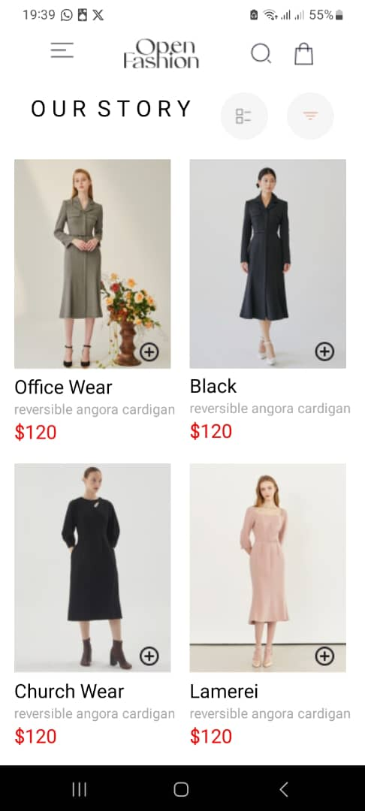
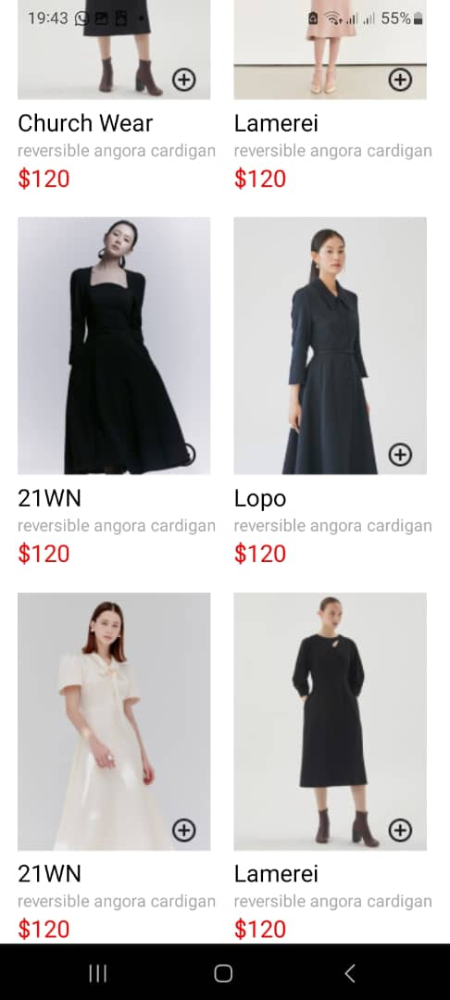
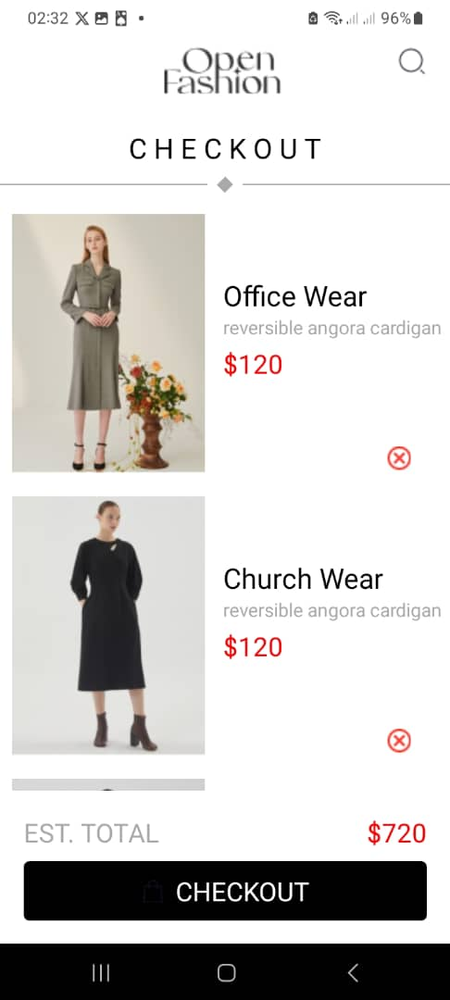
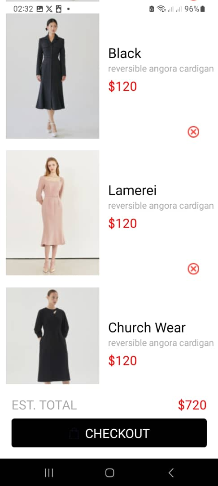
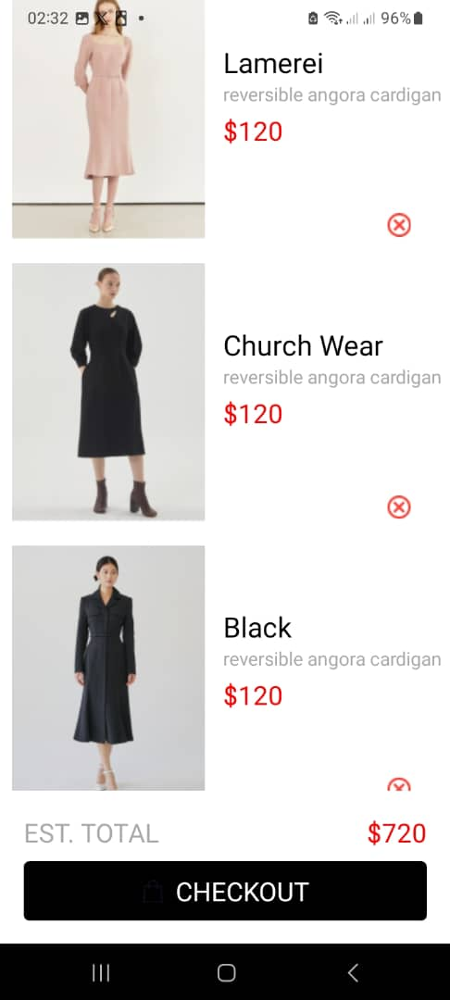
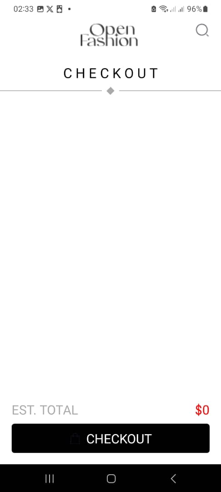
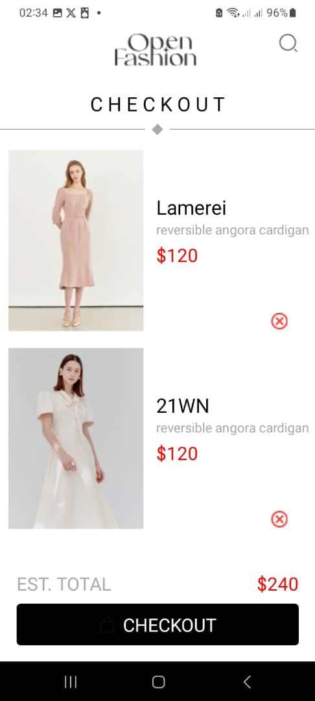

# rn-assignment6-11019725

## A brief README explaining my design choices and how I implemented data storage

### Header

- I created the header as a different component and imported it into the home screen component. I did this to prevent the Stylesheet from looking clumped. The header consists of the menu bar, company logo, search icon, title:"OUR STORY", filter and the list view.

### HomeScreen

- The homescreen consist of the header component that was imported,a list of item image and item details and the implementation of asynchronous data storage to load cart items and add those cart items to CartScreen (thus, store and retreive data). This is how is works:
  - Using useState hook, 'cartItems' is initialized as an empty array.
  - When the data mount the useState hook fetches the data from the Async data storage. 'loadCartItems' an function is used to retrieve the data associated with the key @cart_items from AsyncStorage.If data is found, it is parsed from JSON and set to the 'cartItems, state.
  - The add to cart function, asides adding the cartItems to CartScreen, it saves the data to AsyncStorage.

### CartScreen

- The cartScreen consists of all items that have bee added from the HomeScreen (this is acchieved with route.params and async storage). The items in the CartScreen have the functionaliy to be removed at the click of the red remove images, this is acheived with the use of async data storage.

### ScrollView

- I implemented both the HomeScreen and CartScreen in a scrollView to ensure that items don't take the exact size of the phone but has the capabaility to scroll and accumulate the additional item component beyond the inital height of the phone.

### TouchableOpacity

- To ensure some images had a button-like functionality, i wrapped them in TouchableOpacity and passed an on press function in the opening tag.

## Screenshot of App

#### HomeScreen

#### CartScreen

